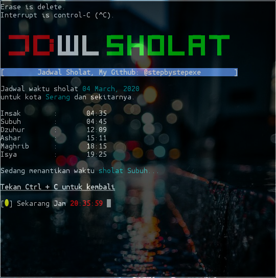

# Jdwlsholat:
*Bismilah spessial ramadhan 1441 H, saya tambahin alarm buat bangunin waktu sahur.* *```Jadawa Sholat``` *ini bisa mengingatkan kita pada waktu sholat. Kalo udah waktunya adzan langusung sholat aja ya.*
#### Screenshot:

#### Cara Menginstall:
```
pkg update && pkg upgrade
apt-get insatll git
apt-get install python
git clone https://github.com/stepbystepexe/Jdwlsholat
cd Jdwlsholat
ls
python3 jdwlsholat.py
```
```
pip3 install -r requirement.txt
```
#### Audio:
Untuk memutar suara install ```mpv```
#### Kontak:
+ Email d_q16x@outlook.co.id
+ WhatsApp https://tinyurl.com/wel4alo
#### Paypal:
+ Onclick https://bit.ly/3dcEQcN
#### LiberaPay:
<noscript><a href="https://liberapay.com/stepbystepexe/donate"></a></noscript>
