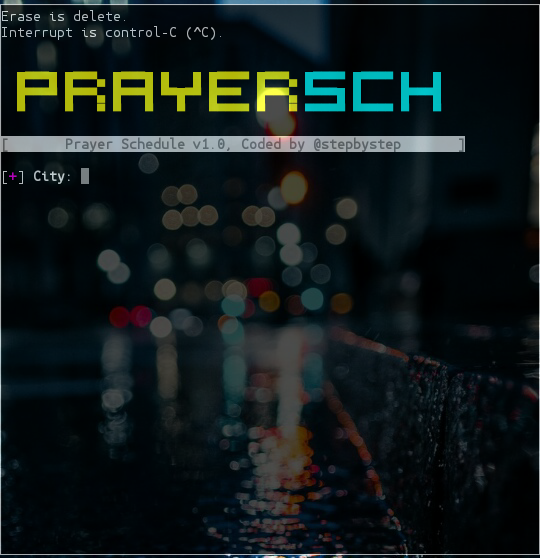

# Screenshot:

# Usage:
```
pkg update && pkg upgrade
apt-get insatll git
apt-get install python2
git clone https://github.com/stephystepexe/Prayersch
cd Prayersch
ls
pytho2 prayersch.py
```
# Paypal:
https://www.paypal.com/cgi-bin/webscr?cmd=_s-xclick&hosted_button_id=CLKRT5QXXFJY4&source=url
# LiberaPay:
<noscript><a href="https://liberapay.com/stepbystepexe/donate"></a></noscript>
